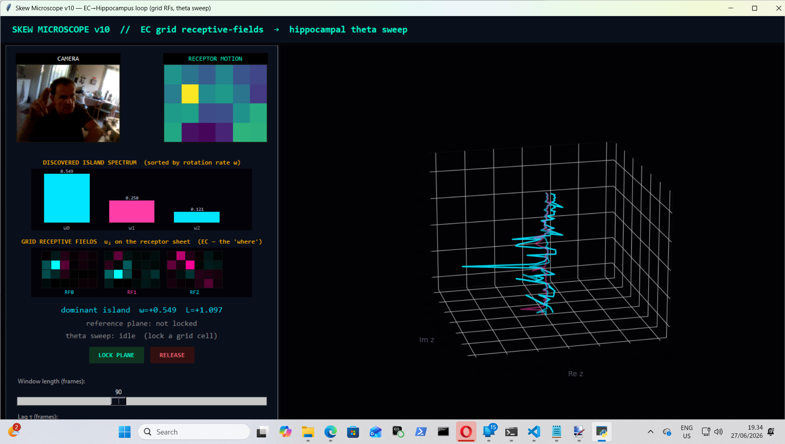

# Geometric Neuron v10 — The Skew Operator as an EC→Hippocampus Loop



### Grid receptive-fields, a theta-gated sweep, and the arrow of time, read live off a sensory surface

**PerceptionLab / Antti Luode, with Claude. Helsinki, June 2026.**

> Do not hype. Do not lie. Just show.

---

## 0. What this is, and what it is not

v9 proved a piece of linear algebra: the spectral islands of the
Geometric-Neuron line are the eigenplanes of the **skew half of one lag
operator**, `A_tau = (C_tau - C_tau^T)/2`, sorted by rotation rate `omega_j`
with chirality `sign(omega_j)` attached. It proved it on a *designed* tour,
offline, in batch.

v10 runs that operator live on an undesigned sensory stream and **closes the
loop** — it adds the prospective half. The result is a small, honest algebraic
reduction of the entorhinal–hippocampal navigation circuit:

- **EC (the "where").** Each island's eigenvector `u_j` is a spatial weight
  pattern over the receptor sheet — a **receptive field**. Lock onto a moving
  object and it becomes a "grid cell" with a visible RF and a rotation rate.
- **Hippocampus (the loop).** The held island's phase is run through a
  theta-gated **predict / correct** loop (the mechanism from `cortical_loop.py`):
  within a theta cycle the phase dead-reckons forward at the held angular
  velocity; at the trough it is corrected toward the observed phase.
- **The sweep (the look-ahead).** That forward projection is rendered as a cone
  *ahead* of the present moment — the honest version of a Moser theta sweep: a
  **generated** forward trajectory, not a relabeled motion read. Reverse the
  motion and the sweep reverses (the left/right alternation); cover the lens and
  it keeps projecting (dead-reckoning).

What is mapped vs what is metaphor is stated up front, because the difference
matters and an instrument that blurs it would be lying:

| claim | status |
|---|---|
| eigenvector `u_j` is a spatial receptive field over receptors | **exact** (it is a weight vector over pixels) |
| lag covariance binds the grid's state at `t` to `t−τ` | **exact** (that is the matrix product) |
| skew half = trajectory/direction, symmetric half = static position | **exact** (the v9 thesis) |
| the held-island predict/correct loop dead-reckons through dropout | **verified in code** (`cortical_loop` mechanism, tested below) |
| this *is* the EC–hippocampal circuit in biology | **analogy** — a functional/algebraic reduction, not a cell model |
| the forward sweep is a Moser theta "look-ahead" | **structural analogy** — a generated projection; the brain's sweep is prospective planning, ours is forward dead-reckoning of observed motion |

The cosmology and the single-cell AIS bet stay in the drawer
`the_rotation_half_grounded.md` built for them. v10 is a population read
statistic with a loop closed on top — nothing here touches the hard problem.

---

## 1. The one operator, restated for a stream

A field is read through receptors, giving overlaps `r_k(t) = <P_k, s(t)>`.
v10's receptors are a `6x4` grid of motion-energy taps on the camera frame.
On a sliding window of `W` frames:

```
C_tau = R[:, tau:] . R[:, :-tau]^T / (W - tau),     R in R^{K x W}
S = (C_tau + C_tau^T)/2     symmetric — power, position, time-symmetric
A = (C_tau - C_tau^T)/2     skew      — rotation, trajectory, the arrow of time
```

`A` is real antisymmetric: spectrum `+/- i omega_j`, eigenvectors are 2-D
rotation planes — the islands. Per island, projecting the window onto the plane
`(u_j, v_j)` to a complex coordinate `z_j(t) = R(t).u_j - i R(t).v_j`:

| quantity | meaning | drawn as |
|---|---|---|
| `u_j` (eigenvector) | spatial receptive field on the grid — the **where** (EC) | the RF panel, painted on the 6x4 sheet |
| `omega_j` | rotation rate of the plane | spectrum bar; spiral pitch |
| `L_j = Im(z_j . z*_{j,lag})` | chirality — the arrow, per island | spiral colour: **cyan** `L>0`, **magenta** `L<0` |
| `v_j` (angular velocity) | signed speed of travel across the RF | drives the theta sweep |

---

## 2. The hippocampal loop: predict, correct, dead-reckon

When you lock a grid cell, its phase enters a theta-gated loop
(`ThetaSweep` in `skew_core.py`), the same predict/correct structure as
`cortical_loop.py`'s EC–hippocampal path integration, applied to the island's
own phase instead of a grid-cell position:

```
lock:        phi <- angle(z_now);   v <- island_velocity(z)
each frame:  if motion:  v <- (1-a) v + a v_obs        # update velocity
             else:       hold v                        # DEAD-RECKON
             phi <- phi + v                            # path-integrate the phase
             at theta trough (and only with input):    # CA1 correction
                 phi <- phi + gain * angle( z_obs / phi )
             sweep <- phi + v * [1..horizon]           # the forward look-ahead
```

**Verified (`skew_core.py`):** seeded on a rotating plane coordinate with an
80-step motion blackout, phase-tracking error is `0.039 rad` with input and
`0.052 rad` *through the blackout* — the loop holds its velocity and keeps the
sweep projecting when the lens is covered, exactly as `cortical_loop.py`
dead-reckons through a sensory blackout. Reverse the motion and the held
velocity flips sign, so the projected sweep reverses — the Moser left/right
alternation, here as a sign flip of `v`.

---

## 3. The grid receptive fields: the "where," made visible

`A`'s eigenplane `u_j` is a vector over receptors — a spatial pattern on the
grid. The RF panel paints each top island's `u_j` back onto the `6x4` sheet, so
you see, per island, **which receptors** carry that rotation (the EC "where")
next to its rate and chirality (the "what direction"). Two independent motions
in two regions produce two eigenplanes with disjoint RF support — two grid
cells, read at once. This is the spatial half the offline tour never had,
because the tour had no sensory surface.

---

## 4. Continuity with the line

| version | read templates | tested on | direction | loop |
|---|---|---|---|---|
| v3 | Takens delay orbit | static field | implicit | — |
| v5 | hand-built edges | tour | per-edge `L_k` | — |
| v8 | eigenvectors of **S** | static hold | none (stalled 0.50) | — |
| v9 | eigenplanes of **A** | designed tour | `sign(omega_j)`, emergent | open-loop read |
| **v10** | **eigenplanes of A, sliding window** | **live stream** | **causal flip** | **theta predict/correct sweep** |

The sweep loop is `cortical_loop.py`'s mechanism; the islands are `v9`'s; the
chirality is `v5`'s `L` (THESIS section 3, ratio -1.000 to the skew flux). v10
does not extend those results — it runs the read operator on a streaming surface
and closes the prospective loop the offline tour could not.

---

## 5. Files

```
skew_core.py         skew_islands() + project_chirality() + island_velocity() + ThetaSweep
                     — the v9 read path on a sliding window, plus the cortical_loop sweep
skew_microscope.py   the live EC->hippocampus instrument (camera -> grid RFs -> islands
                     -> theta sweep) and a headless --selftest
README.md            this document
requirements.txt     numpy, opencv-python, matplotlib, Pillow
```

```bash
python skew_microscope.py --selftest   # verify the math, no webcam
python skew_microscope.py              # live
```

**Live, in one sitting:** lock onto a moving object (it becomes a grid cell, its
RF lights up); watch the green cone extend *ahead* of the present — the theta
sweep; sweep your hand back and forth (the cone reverses, `L` flips); cover the
lens (the loop dead-reckons, the sweep keeps going).

---

## 6. Ledger

**Verified in code (`--selftest` and the loop test, reproduced live):**
- the streaming skew operator recovers a directed stream's rotation rates,
  sorted, unassigned; its eigenplanes are orthogonal (`|<u0,u1>| = 0.000`);
- chirality on a **held** plane flips sign when motion reverses
  (`+0.098 -> -0.098`) — v9's reversal, online and causal;
- the theta loop dead-reckons through an 80-step blackout (phase error
  `0.039 -> 0.052 rad`) — `cortical_loop`'s mechanism on the island's phase;
- the full per-frame path is stable through startup-blank, a 70-frame lens
  cover (all dead-reckoned), and a mid-stream reversal: one flip, no false
  positives.

**Built-in, not emergent:** the receptor layout (`6x4`), the motion-energy
featurisation, the window/lag/theta-period constants. What is *measured* is the
skew spectrum, the per-island RF and chirality, the held-plane flip, and the
loop's dead-reckoning.

**Honest limits:**
- `omega` and `L` scale with input power (`L ~ |z|^2`): the **sign** is the
  invariant (the arrow); the **magnitude** orders islands and is not a
  calibrated frequency. Normalising `A` by the symmetric power is a refinement,
  not done here.
- The theta period is a fixed frame count, not phase-locked to any rhythm in the
  input — it is a clock we impose (as the medial septum does), not one
  discovered.
- The sweep is forward dead-reckoning of *observed* motion. It is **not**
  prospective planning toward a goal (the brain's choice-point sweep generates
  candidate futures it has not observed). Same algebra of "project the held
  velocity forward"; different cause. Stated so it is not mistaken for more.
- Desktop instrument (local camera, Tk, 3-D). A browser/HuggingFace build needs
  the Gradio streaming-webcam port of the same `skew_core.py`.

**Kept in the drawer (inspiration, not claim):** that this is the EC–hippocampal
circuit *in biology* rather than a functional reduction of it; that an AIS reads
its field through this operator; the cosmology. The grounded document's counsel
(read-side flux vs write-side connectivity are dual, not identical) holds.

**The empirical anchor is unchanged and elsewhere:** the trainless EEG
geometric-dysrhythmia result (cross-band eigenmode decoupling `p = 0.007`)
remains the strongest real result in the program and depends on nothing here.

---

## 7. The next builds (named, not claimed)

1. **Multi-site grid cells.** Drive two regions independently; confirm `A`
   returns two RFs with disjoint support, each with its own sweep — two grid
   cells navigating at once. Measure separability (RF overlap, rate separation).

2. **An ephaptic field on the receptors.** Couple the taps through a
   Laplacian/diffusive field before `A` reads them (the population field of
   `the_geometric_neuron_grounded.md`). Does coupling organise the islands
   versus the independent-tap baseline? First place the field becomes a term in
   the operator, not a metaphor.

3. **The spiking / delta-code substrate + where-and-what map.** Event-sample the
   receptors (a spike on motion threshold; v9's tour was already event-sampled),
   and keep a spatial accumulator of where spikes fired and which island they
   fed. The held percept is the near-equilibrium silent regime (`A -> 0`); the
   change is the driven spiking regime (`A != 0`).

4. **Make the arrow thermodynamic** (grounded doc section 8). Run the live
   overlap trajectory through the Lynn et al. entropy-production estimator and
   show the skew flux the instrument prints *is* the entropy production — HOLD
   near detailed balance, SWEEP breaking it. A live broken-detailed-balance
   meter on real sensory input.

5. **Choice-point sweep (toward the real Moser look-ahead).** The honest gap in
   section 6: make the sweep *prospective* by projecting the held velocity down
   two candidate continuations at a branch and alternating between them per theta
   cycle — the actual choice-point behaviour the Mosers measured. This is the
   build that would earn the word "look-ahead" in its full sense.

---

*Helsinki, June 2026. v9 found the islands were the spectrum. v10 gives them a
surface to read, a receptive field that says where, and a theta loop that
sweeps the held trajectory forward and dead-reckons when the world goes dark.
The operator is the same one. Do not hype. Do not lie. Just show.*
